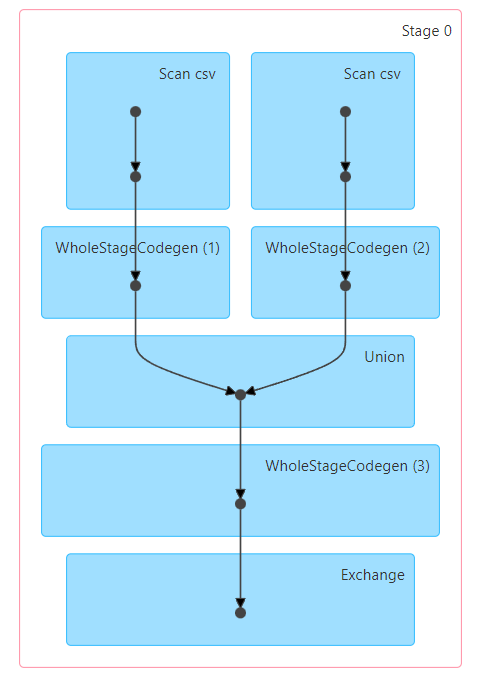

# Scala Multiple Odds Keys

Application reads multiple CSV or TSV files in the same directory handling their extensions particularities. Group By the key and value in all file sources and counting them, keeping only those with Odd count.
After that Writes all content in a new TSV file.


## Usage
**Test Application:**
```
sbt test
```

**Run with SBT:**
```
sbt run 
    --input | -i {S3_INPUT_PATH:'s3a://bucket/input'}
    --output | -o {S3_OUTPUT_PATH:'s3a://bucket/output'}
    --aws-profile | -a {AWS_PROFILE:default}
```

**Submit application:**
```
spark-submit --master {yarn/local/spark:HOST:PORT} --class com.vigil.VigilGeneralDataEngineerApp {JAR_PATH} \ 
    --input | -i {S3_INPUT_PATH:'s3a://bucket/input'}
    --output | -o {S3_OUTPUT_PATH:'s3a://bucket/output'}
    --aws-profile | -a {AWS_PROFILE:default}
```

## Execution Discussions
It was developed two approaches for the exercise. Firstly I started with DataFrame API, and after I reimplemented with RDD API:

### *VigilGeneralDataEngineerApp.executeWithDataFrameAPI @ 32*:

- This approach executes in one Stage, so there are no shuffling
- And executes with all optimization of Catalyst
- Processed in 0.9 seconds on my local machine*


### *VigilGeneralDataEngineerApp.executeWithRDDAPI @ 54*:

- This other approach execute with two Stages, because off reduceByKey (which is better than groupByKey)
- And executed in 0.6 seconds on my local machine*

*These times are not that relevant because the files sizes are too small